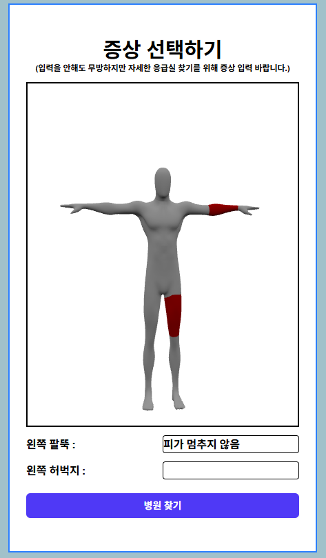
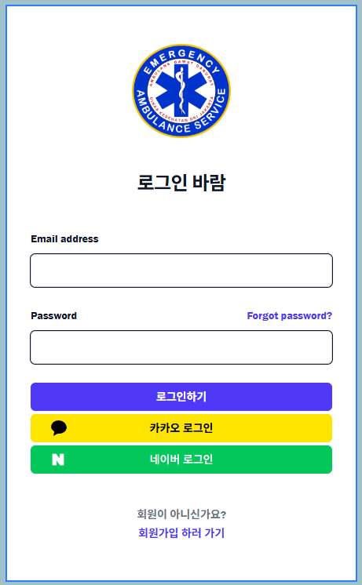

# 응급실 추천 시스템
**사용자가 응급실이 필요한 상황에서 어떤 진료과목이 가능하고 어디에 있는  응급실을 가야할지 고민 될 때 활용 가능한 시스템**

## 기술 스택

### Frontend
  - vue.js
  - JavaScript
  - Tailwind CSS

### 외부 API
- Oauth 구현 API
    - 네이버
    - 카카오
- 지도 API
    - 네이버 지도
    - 카카오 postcodemap

## 개요
최근 사회적 문제인 "응급실 뺑뺑이" 문제를 해결하기 위한 시스템  
본 시스템은 사회적 문제를 해결하기 위해 환자의 증상 기반으로 진료 가능 응급실을 자동 매칭하고, 실시간 응급실 가용 상태를 제공하여 최적의 응급실 선택을 돕는 것을 목표로 한다.

## 문제 정의

### 응급실 정보 파편화 문제

응급상황 발생 시, 환자 또는 보호자는 가장 빠르게 진료 가능한 응급실을 찾아야 한다.
하지만 현재 시스템에서는 응급실마다 가용 병상, 진료 가능 과목, 현재 대기 인원 등이 흩어져 있어 한 번에 파악하기 어렵다.
그 결과, 실시간 상황 판단이 불가능하며, 환자가 적절한 병원을 선택하기 쉽지 않다.

### 응급실 뺑뺑이 현상

정보 부재로 인해 아래와 같은 문제가 발생한다:
가장 가까운 응급실을 방문하더라도 당장 진료가 불가능한 상황을 뒤늦게 알게 됨
다시 다른 응급실로 이동해야 하며, 그 과정에서 시간·비용·위험 부담이 급격히 증가
특히 중증 환자의 경우, 적절한 응급실을 빠르게 찾지 못하면 생명에 직결되는 위험이 발생

### 응급실 뺑뺑이가 발생하는 원인

- 실시간 가용 인원/병상 정보 확인이 어렵다

    - 응급실의 현재 수용 가능 여부,
    - 중환자실/응급 병상 비어 있는지,
    - 응급실 내 대기 인원 현황
이 정보를 즉각적으로 확인하기 쉽지 않다.

- 환자가 필요한 진료 과목을 제공하는지 확인 불가
    - 환자의 증상에 따라 반드시 가야 하는 **전문 진료과목(신경과, 외상센터, 심장내과 등)**이 다 다름
    - 그러나 일반 사용자는 특정 병원이 해당 진료과목을 운영하는지, 현재 진료 가능한 상태인지 알기 어렵다
    - 이 때문에 전혀 진료가 불가능한 응급실을 먼저 방문하는 상황이 빈번하게 발생한다.

## 핵심 기능

 

#### 사용자 위치 입력

- 기본적으로 현재 위치를 받아옵니다.
- 주소 검색을 활용하여 위치변경이 가능합니다.
- 반경을 설정하여 어느 범위에 있는 응급실만 불러올지 조정합니다.
- 주소 입력 후 증상 입력으로 넘어갑니다.

 

#### 사용자 증상 입력

- 마네킹은 360도 회전이 가능하고 진료가 필요한 부위를 선택할 수 있습니다.
- 진료가 필요한 부위를 선택 후 부가 설명을 적을 수 있습니다.
- 증상은 추가하지 않아도 무방하지만 더 정확한 응급실 추천이 가능해 권장합니다.
- 해당 데이터들을 백엔드로 전송해 openAI를 활용하여 진료과목을 추천 받고 해당 추천과목을 기반으로 응급실 추천 리스트를 받아옵니다.

 

#### 사용자 로그인 편의성 추가

- 사용자의 UX 개선을 위하여 Oauth 로그인 방식을 선택하였습니다.
- 급한 상황에서 회원가입을 하기보단 Oauth 로그인을 활용하여 빠른 로그인 후 시스템 사용이 가능합니다.

#### 최종

- 급한 상황에서 사용하는 시스템인만큼 최대한 직관적이고 한눈에 알아볼수 있는 UI로 구성하였습니다.
- 사용자에게 적합한 응급실을 안내함으로써 사회적 문제인 "응급실 뺑뺑이" 문제를 해소할 수 있습니다.

## 기타

<h3><a href="https://github.com/smart-er-match/frontend_ec2/tree/master/%EA%B0%9C%EB%B0%9C%EC%9D%BC%EC%A7%80">개발 일지</a></h3>
