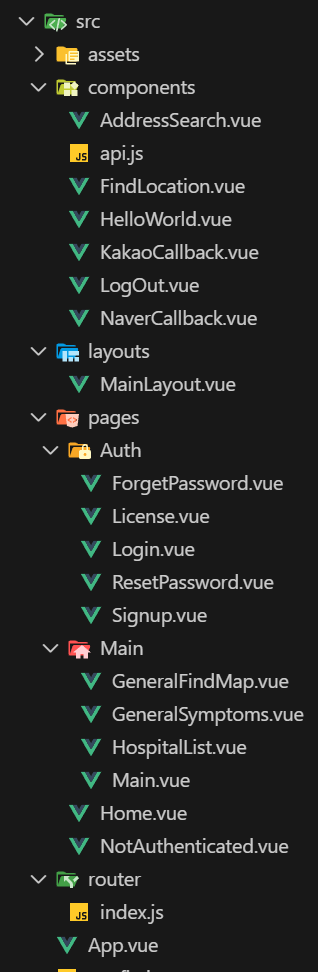
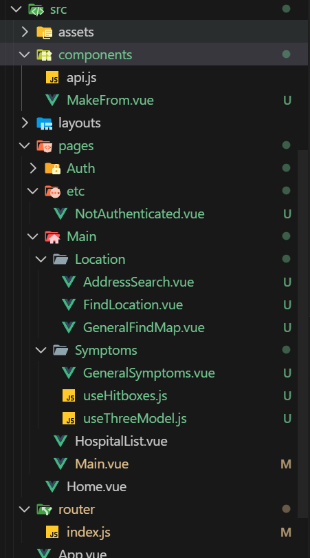

# 개발 일지

## 전날 완료 사항
- 병원 리스트 받은 다음 화면 구성
- access_token, refresh_token 처리

## Today 진행 예정 (1.5hr)
- 리팩토링 점검

## 학습 내용
1. 폴더 구조 변경
    - 기존
    

    - 변경후

    
    - 기능 세분화하여 폴더 정리 차후 유지보수시 파일 찾기 쉬워질 예정
    - Symptoms 기능 component 단위 분리 시도
    

## 완료된것
- 폴더 구조 변경

## 실패한것 + 이유 or 부족한 부분
- Symptoms 기능 component 단위로 분리 시도하였으나 실패
    - 기능들이 너무 많고 연동이 잘안됨
    - 세트로 두는게 정신건강에 이로울 예정

## 내일 할거
- 일요일에 병원리스트 페이지 좀더 세분화
- 레이아웃도 전체적으로 바꿔야 할듯?
